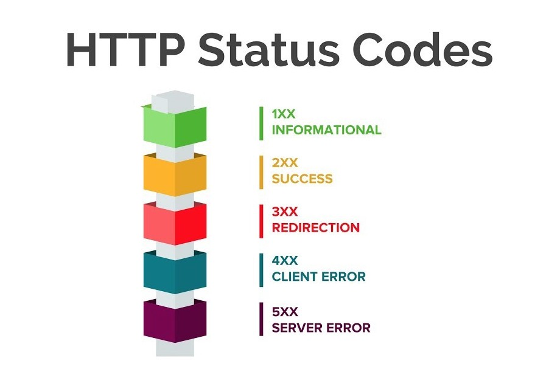

# Bacon Graybeards
Brief CDA "Pire2Pire"

## Table des matières
1. [Intro](#Intro)
2. [Authentification et Mots de passe](#authentification-et-mots-de-passe)  
   2.1. [Définition](#définition)  
   2.2. [Authentification simple & multifacteurs](#authentification-simple--multifacteurs)  
   2.3. [Différents facteurs d'authentification](#différents-facteurs-dauthentification)  
   2.4. [Quelques recommandations d'authentification](#quelques-recommandations-concernant-lauthentification)
3. [HTTPS & CORS](#https--cors)  
    3.1. [HTTP ou HTTPS](#http-ou-https)  
    3.2. [Méthodes](#méthodes)  
    3.3. [Les Headers](#les-headers)  
    3.4. [CORS](#cors)
##	**Intro**
------------------------------------
##	**Authentification et Mots de passe**

###	**Définition**
Il s'agit d'un processus de vérification de l'identité. Ce processus peut-être "simple" ou "multifacteurs".
L’authentification est un mécanisme faisant intervenir deux entités distinctes : un prouveur et un vérifieur :

 - Le prouveur cherche à prouver son identité au vérifieur.

 - Le vérifieur doit être capable de s’assurer de la validité de l’identité du prouveur. 

###	**Authentification simple & multifacteurs**
- **Authentification simple**
    - Il s'agit d'une authentification basique avec le couple utilisateur/mot de passe.
    Le mot de passe peut-être chiffré de manière cryptographique, donnant lieu à une authentification dite "robuste".
- **Authentification multifacteurs**
    - Authentification mettant en œuvre plusieurs facteurs d’authentification appartenant à des types différents.

###	**Différents facteurs d'authentification**
- **Facteur de connaissance**
    - Il s’agit d’une connaissance devant être mémorisée telle qu’une phrase de passe, un mot de passe, un code pin etc...
- **Facteur de possession**
    - Il s’agit d’un élément secret non mémorisable contenu dans un objet physique qui idéalement protège cet élément de toute extraction, tel qu’une carte à puce, un token, un téléphone etc...
- **Facteur inhérent**
    - Il s’agit d’une caractéristique physique intrinsèquement liée à une personne et indissociable de la personne elle-même, telle qu’une caractéristique biologique (ADN), morphologique (empreinte digitale, empreinte rétinienne) etc...

###	**Quelques recommandations concernant l'authentification**
- Mener une analyse de risques lors de la mise en place de moyens d'authentification.
- Privilégier une authentification multifacteurs.
- Privilégier une authentification sur des facteurs de possession.
- Adapter la robustesse des mots de passe à son contexte d'utilisation.
- Utiliser un coffre-fort de mots de passe.

---------------------
##	**HTTPS & CORS**

###	**HTTP ou HTTPS**
- HTTP (Hypertext Transfer Protocol) désigne un protocole de communication entre un client et un serveur.
- HTTPS ou Hypertext Transfer Protocol Secure, il utilise HTTP et SSL qui permet de crypter et de décrypter des informations sensibles.

###	**Méthodes**
- **GET**
    - Permet de recevoir des informations
- **POST**
    - Soumet des données au serveur 
- **PUT**
    - Sauvegarde des modifications de données au serveur
- **DELETE**
    - Supprime des données
- **HEAD**
    - Reçoit des informations du header (en-tête) de la page

###	**Les Headers**
- Les headers contiennent des informations sur les requêtes et réponses HTTP

###	**Code Status**
- **100**
    - Informations
- **200**
    - Action réussie
- **300**
    - Redirections
- **400**
    - Erreur coté client
- **500**
    - Erreur côté serveur

###	**CORS**
- CORS ou Cross-origin Ressource Sharing est un mécanisme qui autorise un site sur une URL à faire une requête de donnée sur une autre URL.

